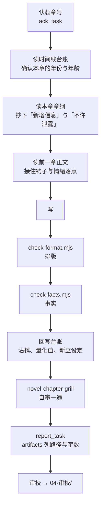

# 一章怎么从章纲走到入库

《合缝》不是从零起步的项目：总纲、五卷细纲、逐章章纲、名词表、两本台账都已经存在，前二十章正文也已落地。本文只写**在这个状态下开工的落差**——哪些上游步骤已经做过了、一章实际怎么走、红线在流程的哪一步生效、以及本机踩过的坑。

各 skill 自己怎么用不在这里，见 `.cursor/skills/*/SKILL.md`；角色分工见 [团队手册](../团队手册.md)。

## 记号

本文用到的编号都在别处权威定义，这张表只给一句话和入口，不展开成第二套定义。

| 记号 | 是什么 | 权威定义 |
| --- | --- | --- |
| 卷一~卷五 | 五卷划分与章号区间 | [总纲 · 全书结构](../02-大纲/总纲.md) |
| 主线单元 / 支线单元 | 30 章 / 10 章的叙事单位 | [总纲 · 单元排布总表](../02-大纲/总纲.md) |
| 字母 + 数字，如 `A1` | 谜团编号，字母是组（A 主线与身份、B 沈鹤年…） | [谜团台账 · 谜团总表](../02-大纲/谜团台账.md) |
| 沾锈 % | 主角的血条，单调递增 | `01-设定/时间线台账.md` 的入器次数与沾锈台账 |
| 致命伤 / 硬伤 | 审校严重度 | [triage-labels.md](./triage-labels.md) |

## 已经做过的上游步骤

对着已有产物再跑一遍，产出的是第二套口径。

| 上游步骤 | 本仓的等价产物 | 因此 |
| --- | --- | --- |
| 定题材与卖点 | `00-调研/` 三份调研 + `写作规范.md` | 结论已成型，引用它，不重做市场判断 |
| 铺全书结构 | `02-大纲/总纲.md` 的五卷表与单元排布总表 | 不重铺。只有出现总纲未覆盖的新方向才考虑 |
| 拆逐章章纲 | `02-大纲/章纲/第N卷章纲.md` | 直接认领章号，不重拆 |
| 建设定台账 | 名词表、时间线台账、谜团台账 | 前置已满足，改动走 [domain.md 的改设定流程](./domain.md#改设定要走的流程) |

**逐章条目散在两个位置**：新位置 `02-大纲/章纲/第N卷章纲.md`（`check-outline.mjs` 只认这里）和旧位置 `02-大纲/第N卷细纲.md`。卷一那 30 条**两边各有一份**——这是「一个设定一处定义」的一处现存违例，改卷一章纲时两处都要动，否则下一个人会读到旧的那份。

要盘家底用 `npm run inventory`，它两边都扫，差额就是 `check-outline.mjs` 看不见的部分。

## 一章怎么走



**第二步不许跳。** 第一卷初稿全线崩过一次，起因就是有人凭记忆写年份。

**回写台账那一步最容易忘，忘了就是下一次崩盘的种子。** 本章对话里只要出现了量化值——百分比、秒数、毫米、次数——都要回写，哪怕它看起来只是随口一提。已经栽过一次：第 13 章的「沾锈从 0.9 涨到 1.8」和「上回你停了十七秒」当时只活在那一句对话里，台账查不到。

## 动章纲的流程不一样

改 `02-大纲/章纲/` 走另一条路，跑的是另一对脚本：

```powershell
node .cursor/skills/novel-fact-check/scripts/check-outline.mjs   # 全不全
node .cursor/skills/novel-fact-check/scripts/check-density.mjs   # 够不够厚
```

前者管章号连续、五个字段齐全、沾锈只出现在单元收束章；后者管一条章纲够不够主笔直接落笔。

**密度脚本的判定基准是「低于硬下限的条数」，不是均值。** 均值会被少数很厚的条目拉起来，二〇二六年八月那一轮加厚盯着均值做，结果只是把「最薄」那顶帽子从卷五传给了卷四。口径见 `02-大纲/章纲密度口径.md`——**它与脚本顶部的常量是两处口径，改一边要同步改另一边。**

各卷章号范围写死在几个脚本顶部的 `VOLUMES` 里，改卷次结构时三处都要同步。

## 红线在哪一步生效

`写作规范.md` 那[四条红线](../00-调研/写作规范.md)不是审查清单，是流程里的具体动作。

**不写盗掘手法与交易渠道、灵异限定在器物残留信息、不碰敏感与血腥**——在写那一步。这三条是内容边界，写的时候就该绕开，审校抓到已经是返工。

**不许用「变强」当爽点**——在**单元收束**那一步，不在写那一步。这条特殊：它是唯一一条声明拦不住的，因为滑坡不是从「决定写升级流」开始的，是从「这一卷没什么可揭的了」开始的。所以它的实际执行点是谜团台账——每个单元收束时对一次账，**存量跌破 8 就停下来补投，不要靠加大冲突强度硬顶。**

另有两条不在那张表里但同样是硬的：

**专业细节不许编**——在写那一步。工序、病害名称、材料、力学常识必须真实；器物、墓葬、人物可以虚构。存疑的直接标出来要求核实，这是本书的壁垒，错一处塌一片。

**正文里不许有 markdown 装饰**——在排版自检那一步。番茄和起点的编辑器不解析 markdown，加粗、分隔线、列表会原样砸在读者眼前。场景分隔符也不许有——换场直接另起一段，靠第一句落时间与地点。

## 机检

一次跑全套：

```powershell
[Console]::OutputEncoding=[Text.Encoding]::UTF8
npm run check
```

`npm run check` = format + facts + outline + ledger。**密度检查不在里面**，改章纲时要单独跑。退出码语义见 [triage-labels.md](./triage-labels.md#机检退出码)。

### 每个脚本答不了什么（2026-08-18 立，通道 3 提）

下面这张表和「取证」那一张是同一个形状，理由也一样：**串错了不会报错，只会给你一个很确信的绿灯。**

| 想问 | 用 | 它答不了 |
| --- | --- | --- |
| 正文有没有 markdown 装饰、章号连不连、段与段之间有没有多余空行 | `check-format.mjs` | 句子通不通、这一章接不接得上上一章 |
| 正文有没有未登记的年份／百分比／禁用词，沾锈有没有回跳 | `check-facts.mjs` | **除沈以外任何姓的人名**；中文写法的量值（「九十一」「两分零七秒」不带百分号也不带阿拉伯数字，一律漏过） |
| 章纲章号齐不齐、五字段全不全、章名与正文对不对得上 | `check-outline.mjs` | 章纲写得好不好；密度够不够（那是 `check-density.mjs`，不在 `npm run check` 里） |
| 一个数被占了几次、各是什么量纲 | `repeated-numbers.mjs` | **这个量的名字被占了没**；而且它默认恒退 0 |
| 正文里有没有人名不在人物表里 | `unregistered-people.mjs` | 哪些是别称、哪些是真漏网——要人去认，认完写进名词表那张别称表 |
| 沾锈链、入器次数、谜团存量跨卷合不合得上 | `book-ledger.mjs` | 单章之内的事 |

**`npm run check` 全绿只证明它查的那几项没错，不证明别的没错。** 这句话听着像废话，但它已经放过去三次，每一次都是绿灯下发生的：

1. **数对了，概念撞了。** 支线 8 第 199 章要一个「六十度」，落笔前跑 `repeated-numbers.mjs`，全书零占用，绿灯。可那个六十度是**开锋角**，而开锋角早就有一个值——第 88~92 章那把青铜錾子的二十五度，靠它认出「有一个人，用一把三点二毫米的錾子，二十五度下刀」。**数不撞，概念撞，而撞的那个是主线的指纹。**
2. **有姓、有台词、签了字，却不在表里。** 名词表写着「正文里出现的人名必须在这张表里」，而 `checkShenNames` 只验沈姓——**这句话对除沈以外的所有姓是一句无人执行的声明。** 已经漏过五个（何同志、小徐、乔副馆长、刘副主任、白老师），五次全是有人为着别的事翻文件时撞见的。现在有 `unregistered-people.mjs` 了。
3. **六章逐段空行，两个机检全程退 0。** 185~190 每章一百多个空行、其余 194 章一律两个，存了不知多久，是有人为别的事去读第 190 章末段才碰上的。**它被发现靠的是运气。** 现在 `check-format.mjs` 有「段落检查」了。

三件事同一个形状，处理办法也同一个：**能变成机检的就变成机检，变不了的写进名词表或本页。** 但更要紧的是那个前提——**看见绿灯时，先想一下这一项到底查了什么。**

## 取证：这东西是谁什么时候改的

这棵树长期不提交，几个会话同时在上面写。**「刚刚变过没有」「变的是哪一句」「这个值什么时候进来的」是三个问题，下面每样工具只答其中一个。** 串错了不会报错，只会得出一个很确信的错误结论，然后让一屋子人去找一个不存在的人。

| 想问 | 用 | 它答不了 |
| --- | --- | --- |
| 这句话是不是新写的 | `git diff -U0 -- <文件>`，看它是不是 `+` 行 | 是谁加的 |
| 这个值历史上什么时候进来的 | `git log -S "<值>" -- <文件>` | 工作区里还没提交的改动 |
| 这个文件刚刚变过没有 | mtime | 变了什么、是人改的还是工具改的 |

**`git diff --stat` 比的是 HEAD，不是「你上次看它的时候」。** 上一个提交以来所有人的活都累在同一份 diff 里，所以它分不出谁刚改的，也分不出这一次改了多少。二〇二六年八月那一轮就是这么读错的：有人拿「273 插入 262 删除」断定「刚发生过一次大重写，有另一个人在写这个文件」，而那一次实际只改了一行，其余全是之前累下来的。同一次里 mtime 用得反而对——它确实证明了文件刚变过；该扔的是 diff 行数那半边。

**机检报红，先问是被检的东西变了，还是检它的东西变了。** 这是最省时间的一问，也是最容易跳过的一问。同一轮里 `check-outline.mjs` 的判据刚从子串匹配换成结构推导，一条旧脚本一直放行的存量违规当场现形——报红不是回归，正是那次修复要达到的效果。而当时全场都在找「谁改坏了章纲」，没有人改过章纲。

**断言要带上取证手段和它的边界。** 「我用 X 查的，所以只能断定 A，断不了 B」比一个光秃秃的结论有用，因为下一个人一眼能看出还差哪一刀。**少说半句好过多说半步**——多走的那半步不会被任何脚本拦住，它只会在别人按它开工之后才现形。

## 本机环境

这些查不到，踩过才知道。分两节是因为其中一半只在当前宿主成立：**换宿主时整节删掉下面的「当前宿主」，不要逐条判断。**

### 当前宿主：Windows + PowerShell

- **跑 node 脚本前必须先设 UTF-8**，`[Console]::OutputEncoding=[Text.Encoding]::UTF8`。不设的话输出全是乱码，而脚本报的正是中文文件名和中文原文，等于什么都看不见。这一条对 `ls`、`git status` 一类列目录的命令同样成立——中文目录名会显示成 `01-�趨`。
- **脚本里的路径是相对仓库根的**（`02-大纲/章纲`、`03-正文`），必须在仓库根跑。在子目录里跑会报找不到目录，看着像脚本坏了。
- **不要用 `Set-Content` 改正文或设定文件。** 它默认不是 UTF-8，会把中文和破折号写成乱码；`-Encoding utf8` 在 Windows PowerShell 5.1 又会写入 BOM，而几个脚本虽然都做了 `replace(/^\uFEFF/, '')`，BOM 仍会污染 diff。需要脚本化批量替换时用 `[System.IO.File]::WriteAllText($path, $text, (New-Object System.Text.UTF8Encoding $false))`。日常改文件走编辑器，不走 shell。
- **git 写 stderr，PowerShell 把 stderr 渲染成红色报错。** `To https://github.com/...` 这类进度信息会显示成 `NativeCommandError`，看着像失败。判断成败只看 `$LASTEXITCODE`。
- **`core.autocrlf=true` 且仓库里没有 `.gitattributes`，所以工作区的行尾不稳定，别拿它当证据。** 经 git 检出过的文件是 CRLF，Agent 直接写出来的是 LF，两者在同一个目录里长期并存。**2026-08-18 踩过一次**：扫出「200 章里有 10 章的标题行带 `\r`，而且正好是连号的十章」，看着像某一批稿子的通病，实际是那十章恰好被 git 检出过——`git diff` 对它们**一处改动都不报**，因为 git 自己就在做这个转换。<br>**所以：行尾差异不是稿子的问题，不要去「修」它，更不要为它加机检**（那种检查会随检出状态忽绿忽红）。真要统一就加 `.gitattributes`，那是仓库级决定，不是随手能做的事。**要判断一批文件是不是同一个人写的，看内容体例，别看字节。**

### 与宿主无关

- **`03-正文/` 被排除在 Vite 的文件监听之外**，否则编辑器的自动保存会不停触发整页刷新，打断正在打字的人。代价是别人在磁盘上改了章节，浏览器里要点顶栏「重新载入」才看得到。开发模式下书架走 `GET /__content/list` 实时读盘，不走 `import.meta.glob`。
- **`npm run build` 出来的是只读书架**，内容在构建时打成快照，所有编辑入口自动隐藏。用它验证正文能不能正常渲染，不要用它来发布内容。
- **改了 skill 要新开会话才加载。** 当前会话的技能列表是会话开始时的快照。
- **`repeated-numbers.mjs` 默认永远退出码 0**，因为它不下判断只摊账。把它接进 CI 或 `npm run check` 之前必须加 `--max=N`，否则它在流水线里等于没跑。
